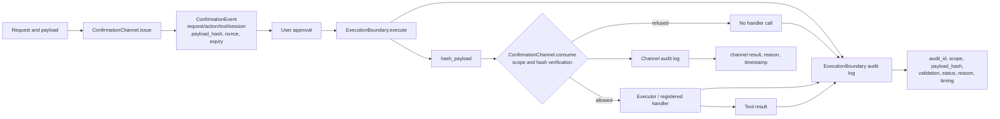
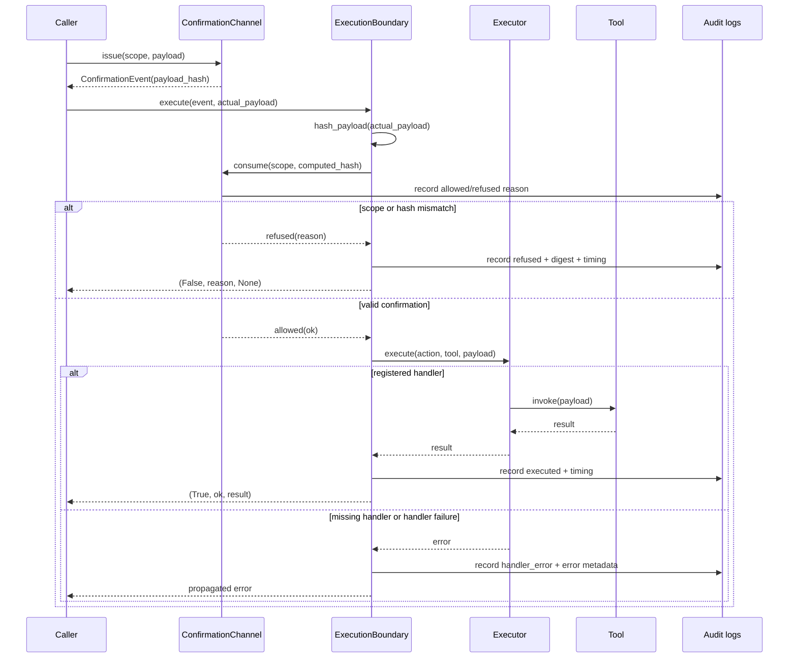

# AION Security Flow Report

## Executive summary

This report describes the current security flow from confirmation issuance to tool execution. The system separates three responsibilities. `ConfirmationChannel` binds approval to request scope and an optional payload digest. `ExecutionBoundary` recomputes the digest at execution time and is the final gate before a handler can run. The audit layers record both the channel decision and the boundary outcome without storing the raw payload in the boundary record.

> **Core rule:** verification is not execution. A valid confirmation becomes executable only after the `ExecutionBoundary` validates the same scope and payload at the execution point.

## System structure


The editable diagram source is available at [aion-security-flow.mmd](aion-security-flow.mmd).



## Component responsibilities

| Component | Responsibility | It does not do |
|---|---|---|
| `ConfirmationChannel` | Issues and validates a single-use, scope-bound confirmation. It compares request identity, action, tool, session, expiry, and payload hash. | It does not invoke a tool handler. |
| `ExecutionBoundary` | Recomputes the payload hash immediately before execution, consumes the confirmation, blocks rejected attempts, and records structured audit data. | It does not choose or implement the tool itself. |
| `Executor` | Resolves an exact `(action, tool)` pair to a registered handler and dispatches the payload. | It does not replace confirmation or boundary validation. |
| Channel audit log | Records every verification or consumption attempt and its reason. | It does not contain the boundary's execution timing or handler error fields. |
| Boundary audit log | Records the execution attempt, scope, payload digest, validation result, final status, reason, timing, and handler error metadata where applicable. | It does not store the raw payload. |

## Complete security flow

### 1. Issuance

`ConfirmationChannel.issue()` creates a `ConfirmationEvent`. The event contains `request_id`, `action`, `tool`, `session_id`, a unique nonce, an expiry time, and an optional `payload_hash`. When a payload is supplied, `hash_payload()` canonicalizes JSON-compatible data with sorted object keys and hashes the result with SHA-256 [1].

The payload binding has two consequences. Equivalent mappings with different key insertion order produce the same digest. List order remains significant because lists are ordered values.

### 2. Approval and channel validation

The user approval is represented by the event. `ConfirmationChannel.consume()` validates the requested scope and payload digest. It also marks the event as used after successful validation. The channel records both accepted and refused attempts in its own in-memory audit log.

The channel's validation order checks time and scope before payload binding, then checks single-use state. A changed payload therefore returns `payload_mismatch`; a correctly bound second use returns `already_used`.

### 3. Execution-time binding

`ExecutionBoundary.execute()` does not trust a hash supplied by the caller. It computes `hash_payload(payload)` from the payload that is actually presented for execution. It passes that digest to `ConfirmationChannel.consume()` together with the execution scope.

If the payload differs from the approved payload, the channel returns `payload_mismatch`. The boundary records a refused attempt and returns `(False, "payload_mismatch", None)`. The handler is not called.

### 4. Handler dispatch

Only after successful consumption does the boundary invoke its handler. In the end-to-end path, that handler delegates to `Executor.execute()`. The executor resolves an exact `(action, tool)` registration. If no matching handler exists, it fails closed with `LookupError`; the boundary records `handler_error` and propagates the exception.

A successful tool call is recorded as `executed`. A confirmation is consumed before the handler invocation, so a replay cannot invoke the handler a second time.

## Security decision flow



## Audit record model

A boundary record has a stable audit identifier and separates validation from final execution status. The `validation` field answers whether the confirmation was accepted. The `status` field answers what happened after that decision.

| Situation | `validation` | `status` | `reason` | Handler called |
|---|---|---|---|---|
| Correct scope and payload; handler succeeds | `allowed` | `executed` | `ok` | Yes |
| Payload changed | `refused` | `refused` | `payload_mismatch` | No |
| Confirmation replayed | `refused` | `refused` | `already_used` | No |
| Correct confirmation; no registered tool | `allowed` | `handler_error` | `handler_error` | Boundary attempted dispatch |
| Correct confirmation; handler raises | `allowed` | `handler_error` | `handler_error` | Yes |

The record includes `payload_hash`, not the raw payload. This limits accidental disclosure in the boundary audit trail while preserving enough information to compare the execution attempt with the approved binding.

## Evidence and limits

The current implementation and tests establish the behavior of the in-memory channel, boundary, executor registry, and their integration. They do not establish durable storage, tamper-evident audit persistence, multi-process locking, cryptographic signing of audit records, or a real operating-system sandbox. The current audit logs are process-local Python lists and are cleared by process restart or an explicit `clear_audit_log()` call.

The boundary consumes confirmation before calling the handler. If the handler fails after consumption, the event remains used. This prevents accidental replay, but a production retry policy would need a separate idempotency or recovery design rather than reusing the confirmation.

## Verification snapshot

The current local test suite covers the channel, payload hashing, boundary, executor, end-to-end execution, and audit outcomes. The last verified run reported:

```text
41 passed
```

The report describes code present in the local project at the time of generation. The authoritative implementation files are [channel.py](aion/execution/channel.py), [boundary.py](aion/execution/boundary.py), and [executor.py](aion/execution/executor.py). The principal integration tests are [test_execution_end_to_end.py](tests/test_execution_end_to_end.py) and [test_execution_audit.py](tests/test_execution_audit.py).

## References

[1]: aion/execution/channel.py "AION ConfirmationChannel implementation and payload hashing"
[2]: aion/execution/boundary.py "AION ExecutionBoundary implementation and structured audit logging"
[3]: aion/execution/executor.py "AION Executor action/tool dispatch implementation"
[4]: tests/test_execution_end_to_end.py "AION end-to-end confirmation, boundary, and executor tests"
[5]: tests/test_execution_audit.py "AION ExecutionBoundary audit logging tests"
